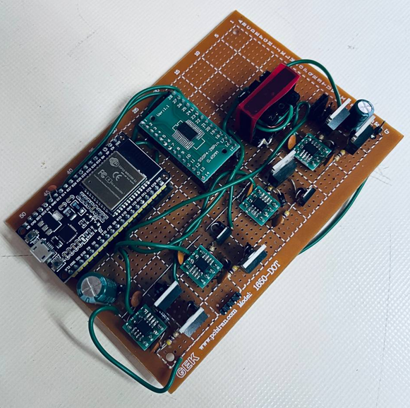

# Dual Active Bridge Converter with ESP32 Control
Dual active bridge design + Circuit test



## Project Overview

The project focuses on designing and implementing a DAB converter with the following features:
- **Phase-Shift Control**: Regulates power using phase-shift modulation.
- **High Precision**: Utilizes the AD7190 ADC for accurate voltage and current measurements.
- **PID Regulation**: Maintains desired output voltage via a PID controller.

## Hardware Components

- **Microcontroller**: ESP32
- **ADC**: AD7190 (24-bit Sigma-Delta ADC)
- **Power Stage**:
  - **MOSFETs**: IRF540N
  - **Transformer**: Custom-designed with turns count \( Np = 15, Ns = 3 \), core EE25/9/6.5
  - **Inductor**: 12.4 µH (Removed due to high transformer leakage inductance)
  - **Capacitor**: 1328 µF
- **Gate Driver**: IR2103 

**Note**: I've used Tim McRae's DAB design youtube video in this design. youtube video link: https://www.youtube.com/watch?v=w5SGHoz5zPE
Results from the video are written in a [MATLAB file](src/matlab_script/calc.m) for easy calculation.

## Software Components

- **MCPWM Configuration**: Uses the ESP32's Motor Control PWM module to generate phase-shifted PWM signals.
- **AD7190 Driver**: Interfaces with the ADC for precise measurements. (by [@gism](https://github.com/gism/ESP32_AD7190))
- **PID Control**: Adjusts phase shift to regulate output voltage.
- **Serial Communication**: Enables setpoint adjustment via serial input.

## Transformer Design

The transformer is optimized for the DAB converter with these specifications:
- **Turns Ratio**: \( n = 0.2 \), minimizing inductor current ripple at 25 V input.
- **Core**: EE25/9/6.5 ferrite, selected based on window area product (WaAc) of 2678.57, calculated using:
  - Output Power: 50 W
  - Current Density: 750 Circ Mil/Amp
  - Topology Factor: 0.0014 (Full-bridge)
  - Max Flux Density: 1000 Gauss at 100 kHz
  - Switching Frequency: 100 kHz

  **Note**: Transformer was designed with help of this [article](https://www.mag-inc.com/Design/Design-Guides/Transformer-Design-with-Magnetics-Ferrite-Cores?lang=zh-CN)

## Control Mechanism

Power transfer is regulated by adjusting the phase difference between PWM signals driving the H-bridges. In the ESP32, this is achieved using the MCPWM module:
- PWM phase difference was achieved by tackling with MCPWM dead time modules. first a pair of identical PWM signals are created. then both rising-edge and falling-edge dead times added to one of PWM signals to make a phase difference with the other PWM signal.
- Dead time adjustments shift the PWM signals, controlling the power flow direction and magnitude.
```c++
void update_phase(double phase) {

  uint32_t pd = (phase / 180.0) * max_dt;

  //module 0
  REG_WRITE(0x3FF5E05C, (uint32_t)pd); //Shadow register for falling edge delay(FED)
  REG_WRITE(0x3FF5E060, (uint32_t)pd); //Shadow register for rising edge delay(RED)
  //module 1
  REG_WRITE(0x3FF5E094, (uint32_t)pd); //Shadow register for falling edge delay(FED)
  REG_WRITE(0x3FF5E098, (uint32_t)pd); //Shadow register for rising edge delay(RED)
  return;
}
```


## Setup and Usage

**Note**: DAB main circuit schematic in proteus is also available


**Note**: I've used [Serial Studio](https://github.com/Serial-Studio/Serial-Studio) to monitor output data visually with graphs


> Channel 1: Setpoint 
>
> Channel 2: Measured output voltage (in mili-volt)
>
> Channel 3: Error
>
> Channel 4: Shunt Resistor voltage (Shunt Res value: 0.008 Ohm)
>

## Notes

- PID parameters may need tuning based on hardware specifics.

## Contributor

 - [Amir Rahmani](https://gitlab.com/amirrhmni)
